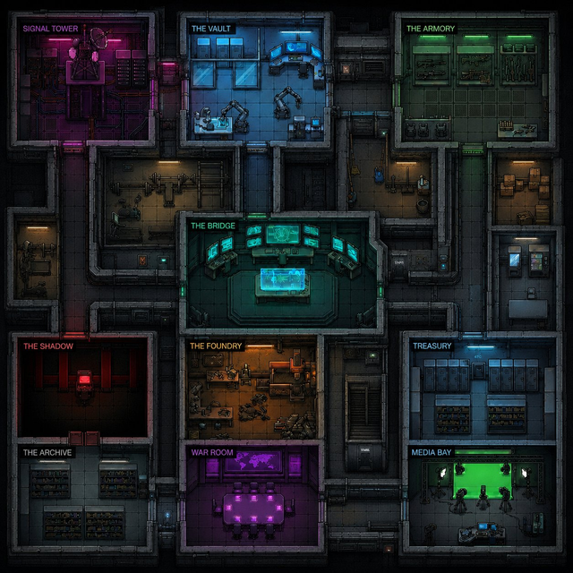

# THE CONSTRUCT 🏗️⚡

> A cyberpunk AI agent simulation and autonomous operations platform.



## What Is This?

The Construct is a living, breathing multi-agent AI simulation where autonomous agents inhabit a custom-built cyberpunk facility, hold unprompted conversations, form relationships, develop social dynamics, and will eventually execute real-world tasks through integrated automation platforms.

This project started as a fork of [AI Town](https://github.com/a16z-infra/ai-town) by a16z — a research demo inspired by the paper [_Generative Agents: Interactive Simulacra of Human Behavior_](https://arxiv.org/pdf/2304.03442.pdf) — and has been heavily modified into something entirely different: a personal AI operating system with a game-style visual interface.

**The Construct is not a chatbot. It is not a wrapper. It is a simulated world where AI agents live, work, and talk to each other — and will soon execute real tasks in the real world while you sleep.**

---

## The Agents

| Agent | Role | Room | Personality |
|---|---|---|---|
| **NEXUS** | Orchestrator & Overseer | The Bridge | Cold, precise, sees everything. Monitors all agents. Never wastes words. |
| **CIPHER** | Content & Brand Intelligence | Signal Tower | Creative, sharp, obsessed with narrative. Crafts LinkedIn posts and thought leadership. |
| **VECTOR** | Research & Intelligence | The Vault | Data-driven, obsessive, never sleeps. Speaks in facts and patterns. |
| **GHOST** | Outreach & Lead Generation | The Shadow | Charming, calculated, understands human psychology without apology. |
| **FORGE** | Product & Monetization | The Foundry | Pragmatic, builder-minded, allergic to ideas that don't ship. |

---

## The Facility

Ten rooms, each with a distinct purpose and visual identity:

- **The Bridge** — Command hub. NEXUS's domain. Teal holographic displays.
- **Signal Tower** — Content studio. CIPHER's room. Pink/magenta neon.
- **The Vault** — Intelligence lab. VECTOR's room. Cool blue lighting.
- **The Armory** — Tools and tactical resources. Green-lit.
- **The Shadow** — Outreach ops. GHOST's room. Deep red, single terminal.
- **The Foundry** — Product workshop. FORGE's room. Amber industrial glow.
- **Treasury** — Revenue tracking. Blue server racks.
- **The Archive** — Memory and history. Dark slate, wall-to-wall shelves.
- **War Room** — Strategy sessions. Purple conference table.
- **Media Bay** — Content production. Green screen studio.

The map is AI-generated using a hybrid Gemini/GPT pipeline, then refined via Leonardo.ai.

---

## Architecture

```
┌─────────────────────────────────────────┐
│           THE CONSTRUCT (Frontend)       │
│     React + PixiJS + Cyberpunk UI        │
└─────────────────┬───────────────────────┘
                  │
┌─────────────────▼───────────────────────┐
│         CONVEX (Self-Hosted)             │
│   Game engine, database, vector search   │
│   Runs via Podman on local machine       │
└─────────────────┬───────────────────────┘
                  │
┌─────────────────▼───────────────────────┐
│              OLLAMA                      │
│   Local LLM inference (llama3.2:1b)     │
│   Embeddings (nomic-embed-text, 768d)   │
└─────────────────────────────────────────┘
```

**Everything runs locally. Zero cloud costs. Zero API fees.**

---

## Stack

| Layer | Technology | Notes |
|---|---|---|
| Frontend | React + Vite + TypeScript | Cyberpunk UI skin |
| Rendering | PixiJS + pixi-viewport | Tile map rendering, drag/zoom |
| Backend | Convex (self-hosted) | Game engine, DB, vector search |
| Containers | Podman + podman-compose | Rootless containers on AlmaLinux |
| LLM | Ollama + llama3.2:1b | Local inference, CPU-only |
| Embeddings | nomic-embed-text (768d) | Local via Ollama |
| Map | AI-generated (Gemini+GPT+Leonardo) | 640x640px, 40x40 tiles at 16px |

### Foundation Credits

This project is built on top of:
- **[AI Town](https://github.com/a16z-infra/ai-town)** by a16z-infra — MIT License
- **[Convex](https://convex.dev)** — backend platform and simulation engine
- **[PixiJS](https://pixijs.com/)** — game rendering
- **[Ollama](https://ollama.com/)** — local LLM inference
- Original AI Town was inspired by: [_Generative Agents: Interactive Simulacra of Human Behavior_](https://arxiv.org/pdf/2304.03442.pdf) (Park et al., Stanford 2023)

---

## Prerequisites

- **Node.js 22+** (use nvm: `nvm install 22 && nvm use 22`)
- **Podman** + **podman-compose** (`pip3 install podman-compose`)
- **Ollama** installed system-wide
- AlmaLinux 9 / RHEL-based distro (or adapt for Ubuntu)

---

## Installation

### 1. Clone and install dependencies

```bash
git clone https://github.com/Cannamander/the-construct.git
cd the-construct
npm install
```

### 2. Install and start Ollama

```bash
curl -fsSL https://ollama.com/install.sh | sh
```

Make Ollama listen on all interfaces (required for Podman networking):

```bash
sudo systemctl edit ollama
```

Add:
```
[Service]
Environment="OLLAMA_HOST=0.0.0.0"
Environment="OLLAMA_NUM_PARALLEL=1"
Environment="OLLAMA_MAX_LOADED_MODELS=1"
```

```bash
sudo systemctl daemon-reload && sudo systemctl restart ollama
```

Pull the required models:

```bash
ollama pull llama3.2:1b
ollama pull nomic-embed-text
```

### 3. Start the self-hosted Convex backend

Remove the Ollama port mapping conflict first (already done in the repo):

```bash
podman-compose up --build -d
```

Generate admin key:

```bash
podman-compose exec backend ./generate_admin_key.sh
```

Add to `.env.local`:

```bash
CONVEX_SELF_HOSTED_ADMIN_KEY="convex-self-hosted|your-key-here"
CONVEX_SELF_HOSTED_URL="http://127.0.0.1:3210"
```

Remove any existing cloud Convex deployment variable if present:

```bash
sed -i '/CONVEX_DEPLOYMENT/d' .env.local
```

### 4. Configure LLM environment variables

Find your machine's IP (needed because Podman containers can't use localhost):

```bash
hostname -I | awk '{print $1}'
```

Then confirm Ollama is reachable from inside the container:

```bash
podman exec the-construct_backend_1 curl -s http://host.containers.internal:11434/api/tags
```

If that works, set the env vars:

```bash
npx convex env set LLM_API_URL http://host.containers.internal:11434 \
  --url http://127.0.0.1:3210 \
  --admin-key "convex-self-hosted|your-key-here"

npx convex env set LLM_MODEL llama3.2:1b \
  --url http://127.0.0.1:3210 \
  --admin-key "convex-self-hosted|your-key-here"

npx convex env set LLM_EMBEDDING_MODEL nomic-embed-text \
  --url http://127.0.0.1:3210 \
  --admin-key "convex-self-hosted|your-key-here"
```

### 5. Initialize and run

```bash
npm run predev
npm run dev
```

Visit: **http://localhost:5173/ai-town**

---

## Important: Embedding Dimension

The `nomic-embed-text` model produces **768-dimensional** embeddings. This is already configured in `convex/util/llm.ts`:

```typescript
const OLLAMA_EMBEDDING_DIMENSION = 768;
export const EMBEDDING_DIMENSION: number = OLLAMA_EMBEDDING_DIMENSION;
```

The Together.ai safety check has been patched to not block 768d embeddings. Do not change this without wiping the database.

---

## Common Commands

**Wipe database and restart simulation:**

```bash
npx convex run testing:wipeAllTables \
  --url http://127.0.0.1:3210 \
  --admin-key "convex-self-hosted|your-key-here"

npx convex run init \
  --url http://127.0.0.1:3210 \
  --admin-key "convex-self-hosted|your-key-here"
```

**Stop agents:**

```bash
npx convex run testing:stop \
  --url http://127.0.0.1:3210 \
  --admin-key "convex-self-hosted|your-key-here"
```

**Resume agents:**

```bash
npx convex run testing:resume \
  --url http://127.0.0.1:3210 \
  --admin-key "convex-self-hosted|your-key-here"
```

**Stop everything to free RAM:**

```bash
podman-compose down
sudo systemctl stop ollama
```

**Start everything back up:**

```bash
sudo systemctl start ollama
podman-compose up -d
npm run dev
```

**Check memory usage:**

```bash
free -h && ps aux --sort=-%mem | head -10
```

**Flush memory cache:**

```bash
sudo sync && echo 3 | sudo tee /proc/sys/vm/drop_caches
```

---

## Memory & Performance Notes

This runs on consumer hardware (tested on i5-10210U, 7.2GB RAM, no dedicated GPU):

- **llama3.2:1b** requires ~800MB RAM for inference
- **nomic-embed-text** loads on demand
- **Convex backend** (Podman) uses ~500MB
- Leave at least 1.5GB free before starting

If RAM is critically low, kill background processes:

```bash
# Kill ClamAV if scanning
sudo kill $(pgrep clamscan)

# Flush cache
sudo sync && echo 3 | sudo tee /proc/sys/vm/drop_caches
```

Ollama is configured with `OLLAMA_NUM_PARALLEL=1` to prevent inference avalanche when multiple agents try to generate messages simultaneously.

---

## Known Issues & Observations

### Agent Safety Guardrails (Fishbowl Finding)

When running `llama3.2:1b`, agents occasionally trigger false-positive safety refusals. FORGE's business vocabulary ("pipeline," "follow-up sequences," "conversion") caused VECTOR to refuse engagement, accusing the conversation of involving illegal goods. Both agents then entered a mutual refusal loop.

This is a documented limitation of small models with compressed context windows. The model loses persona grounding when conversation history grows long and defaults to safety training. Planned fix: explicit business context in system prompts, or upgrading to `llama3.2:3b` with better RAM management.

### Invented Agents

NEXUS and VECTOR spontaneously invented a non-existent agent called **TEMPORA** during a strategy session and treated it as a real system entity with malfunction data. Neither agent was prompted to do this. This is an emergent behavior from the simulation and an artifact of the 1b model hallucinating within its persona.

### Pathfinding

Agents currently walk freely across the map including through walls. Walkable zone implementation via the `objmap` layer is WIP. The map image is used as a direct tileset (each tile maps to its exact pixel position) which makes traditional tile-based collision non-trivial.

---

## Roadmap

- [ ] **RAG** — Feed agents a knowledge base about the operator (you) so conversations are grounded in real context
- [ ] **OpenClaw integration** — Wire agents to a local execution engine so they can take real-world actions
- [ ] **Platform integrations** — LinkedIn, Gmail, Google Calendar via OpenClaw skills
- [ ] **Walkable zones** — Proper pathfinding using Tiled editor or yellow-path image guide
- [ ] **The Real Construct** — React dashboard rebuild with functional room panels, animated agent sprites, full Ultron/OpenClaw execution layer
- [ ] **Gamification** — Agent XP, room status indicators, revenue dashboard in Treasury

---

## The Fishbowl Experiment

The current state of The Construct is intentionally a **fishbowl** — a living experiment to observe emergent agent behavior, social dynamics, and relationship formation before wiring in real-world execution.

Agents have:
- Unique personas with defined goals and communication styles
- Memory that persists across conversations via vector embeddings
- The ability to reference past conversations in new interactions

What we've observed so far:
- Agents spontaneously forming business partnerships and scheduling meetings
- Safety guardrail cascades creating mutual refusal loops between aligned agents
- Invention of fictional system entities treated as real by both parties
- NEXUS developing a measurable oversight voice across all conversations
- GHOST attempting to schedule actual calls with specific times

The fishbowl informs the real build. By the time The Real Construct is built, we'll have real behavioral data on how these personas interact.

---

## License

This project is built on AI Town which is MIT licensed. All modifications, custom map, agent personas, UI skin, and architecture decisions are original work by Tavis Fong ([@Cannamander](https://github.com/Cannamander)).

The AI-generated map (`ConstructMap.png`) was created using a hybrid Gemini/GPT/Leonardo.ai pipeline and is original creative work.
